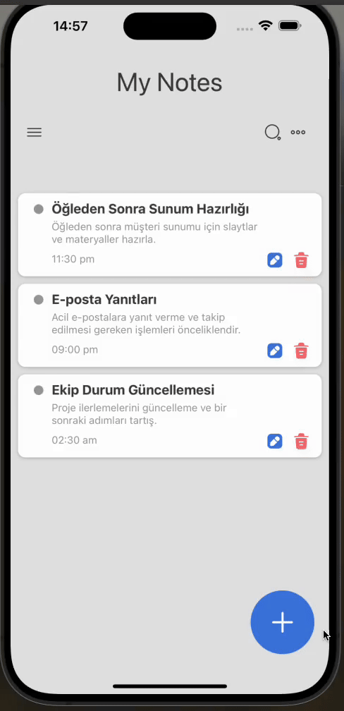

<h1>Note App</h1>

This project is a mobile note-taking application developed using React Native. The app allows users to create, organize, and store notes. It emphasizes performance, user experience, and simplicity to enable users to easily manage their notes.

<h2>Used Technologies</h2>

<ul>
    <li>**React Native**: Used to develop a mobile application with performance similar to native apps.</li>
    <li>**Context API**: Utilized for managing application state, enabling efficient handling and storage of notes.</li>
    <li>**React Navigation**: Integrated for seamless navigation between different screens of the app.</li>
    <li>**UI Library (optional)**: Utilized for designing a visually appealing and user-friendly interface.</li>
</ul>

<h2>Screen Gif</h2>

